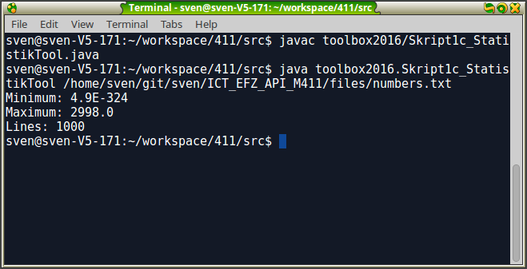

## Übung: Elementare Array - Funktionalität

**Lernziel:**

* Deklarieren und Instanziieren von Arrays
* Beherrschen von elementweisenem Zugriff mit Indices
* Iterieren über alle Elemente eines Arrays
* Erstellen elementarer Array-Funktionen 

**Zeit:** 45 Minuten

Erstellen Sie in Ihren `M411` Projekt eine neue Klasse `Skript1c_ArrayOps`. In dieser Klasse implementieren und testen Sie die folgenden statischen Funktionen. Beachten Sie die Schnittstellenbeschreibungen - Ein- und Ausgaben sollen nur in der `main`-Methode vorkommen. Zu jeder Teilaufgabe erstellen Sie sinnvolle Testfälle in der `main`-Methode.

### Minimum und Maximum in einem Array suchen

Erstellen Sie je eine Funktion `getMinimum` und `getMaximum`. Die Funktionen sollen einen `int` Array als Parameter übernehmen und jeweils das Minimum bzw. Maximum bestimmen und zurückliefern. Verwenden Sie zum Testen in der `main`-Methode Arrays mit zehn Elementen mit fix-definierten oder zufällig gewählten Werten.

### Arrays addieren

In der Vektoralgebra (die mathematische Grundlage für 3D - Games) müssen oft Arrays miteinander verrechnet werden. Für die Addition zweier Felder `a` und `b` in das Ergebnisfeld `c` wird elementweise das erste Element von `a` mit dem ersten Element von `b` addiert und im ersten Element von `c` gespeichert, dann dasselbe für das zweite Element und alle weiteren. 

{#fig:fig_array_add}

Dies funktioniert nur, wenn die Arrays die gleiche Länge haben.
Erstellen Sie eine statische Funktion `addArray`. `addArray` erhält zwei `int`-Arrays als Parameter und gibt einen `int`-Array als Summe der Eingabe-Arrays zurück. Vor der Addition soll die Funktion prüfen, ob die Eingabefelder gleich lang sind. 

### Elemente nachrutschen

Erstellen Sie ein Funktion `prepend` mit einen Array und einen `int`-Wert in der Parameterliste. In der Funktion
soll jeweils das neue Element an der ersten Stelle im Array eingefügt
und die bereits vorhandenen Elemente hinten angefügt werden. Nach
jeder Einfüge-Operation sollen alle Elemente des Arrays zurückgegeben werden.

### Zusatz: Performance testen mit Zeitmessung
In dieser Aufgabe vergleichen Sie die Performance einer *selbstgebastelten* schleifenbasierten Kopierfunktion für Arrays mit der Performance der Java-Kopierfunktion `System.arrayCopy`. 
Mit `long t0 = System.currentTimeMillis();` können Sie die aktuelle Systemzeit in Millisekunden aufnehmen.
Kopieren sie den eingelesenen Array 1000 mal mit einer for-Schleife in neuen Array kopieren und messen Sie die dazu benötigte Zeit. 
Vergleichen Sie den Zeitaufwand, wenn Sie das gleiche 1000 mal mit System.arrayCopy(...) kopieren. 

	**Lösungsvorschlag:**
	
	`Skript1c_ArrayOps.java`

### Zusatz: Terminal-App
Viele Systembefehle funktionieren nur auf der Konsole bzw. im Terminal. Oft bringen solche Programme eine Unzahl von verschiedenen Parametern mit (z.B. `dir *.txt`).
Sie erstellen nun selbst ein solches Konsolenprogramm zum Bestimmen des Maximums und Minimums von Zahlenreihen in einer beliebigen Datei (eine Zeile enthält eine Zahl). Der Dateiname soll dabei als Parameter übergeben werden.

{#fig:fig_terminal_params}

1. Erstellen Sie eine neue Klasse `StatistikTool` mit `main(String[] args)` Funktion.
2. `String[] args` enthält alle via Konsole übergebenen Parameter (Leerzeichen-getrennt). Geben Sie in der `main` alle Elemente des `args`-Arrays auf der Konsole aus. Starten Sie Ihrer Klasse via Commandozeile `java StatistikTool "D://numbers.txt" alpha beta gagga` und prüfen Sie die Ausgabe. Sie müssen natürlich den Pfad zu Ihrer Datei angeben.
Prüfen Sie, ob mit `args[0]` der Name des Programms ausgeben wird.
3. Anstatt die `args` auszugeben, erstellen Sie mit dem ersten Parameter ein `File`-Objekt und daraus ein `BufferedReader`-Objekt. Wenn das nicht klappt, geben Sie eine Fehlermeldung *ungültige Datei* aus.
4. Da Sie nicht wissen, wie viele Elemente die Liste enthält, lesen Sie zeilenweise vom BufferedReader und parsen sofort die Zahlenwerte. Wenn der aktuelle Wert kleiner als das aktuelle Minimum bzw. grösser als das aktuelle Maximum ist, speichern Sie den aktuellen Wert an der entsprechenden Stelle. 
5. Enthält die aktuelle Zeile keine Zahl, fangen Sie die entsprechende Exception und geben eine sinnvolle Fehlermeldung aus, bovor die nächste Zeile gelesen wird.
6. Zum Schluss geben Sie auf der Konsole die Anzahl gültiger Zahlen in der Datei sowie das Minimum und das Maximum auf der Konsole aus.

	**Lösungsvorschlag:**
	
	`Skript1c_StatistikTool.java`
