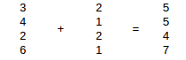

## Übung: Elementare Array - Funktionalität

**Lernziel:**

* deklarieren und instanziieren Arrays
* beherrschen elementweisen Zugriff mit Indexen
* iterieren über alle Elemente eines Arrays
* erstellen elementare Array-Funktionen 

**Zeit:** 45 Minuten

Erstellen Sie in Ihren `M411` Projekt eine neue Klasse `Skript1c_ArrayOps`. In dieser Klasse implementieren und testen Sie die folgenden statischen Funktionen. Beachten Sie die Schnittstellenbeschreibungen - Ein- und Ausgaben sollen nur in der `main`-Methode vorkommen. Zu jeder Teilaufgabe erstellen Sie sinnvolle Testfälle in der `main`-Methode.

### Minimum und Maximum in einem Array suchen

Erstellen Sie je eine Funktion `getMinimum` und `getMaximum`. Die Funktionen sollen einen `int` Array als Parameter übernehmen und jeweils das Minimum bzw. Maximum bestimmen und zurückliefern. Verwenden Sie zum Testen in der `main`-Methode Arrays mit zehn Elementen mit fix-definierten oder zufällig gewählten Werten.

### Arrays addieren

In der Vektoralgebra (die mathematische Grundlage für 3D - Games) müssen oft Arrays miteinander verrechnet werden. Für die Addition zweier Felder `a` und `b` in das Ergebnisfeld `c` wird elementweise das erste Element von `a` mit dem ersten Element von `b` addiert und im ersten Element von `c` gespeichert. 

Dies funktioniert nur, wenn die Arrays die gleiche Länge haben.
Erstellen Sie eine statische Funktion `addArray`. `addArray` erhält zwei `int`-Arrays als Parameter und gibt einen `int`-Array als Summe der Eingabe-Arrays zurück. Vor der Addition soll die Funktion prüfen, ob die Eingabefelder gleich lang sind. 

### Elemente nachrutschen

Erstellen Sie ein Funktion `prepend` mit einen Array und einen `int`-Wert in der Parameterliste. In der Funktion
soll jeweils das neue Element an der ersten Stelle im Array eingefügt
werden und die bereits vorhandenen Elemente hinten angefügt werden. Nach
jeder Einfüge-Operation sollen alle Elemente des Arrays zurückgegeben werden.

	**Lösunsvorschlag:**
	
	`Skript1c_ArrayOps.java`