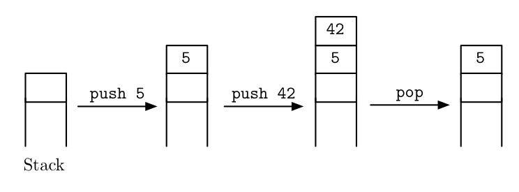

Dynamische Datenstrukturen II: Stacks und Queues
==========================================

Lernziele {#lernziele_stacks_queues}
-----------
* beschreiben Eigenschaften der Datenstruktur Stack (Stapel) und Queue
* einsetzen Datatenstrukturen Stack und Queue
* implementieren und anwenden Interface `Iterator`

Die verkettete Liste als Stapel-Speicher
---------------------------------------------------

Mit Hilfe der *verketteten Liste*, können wir eine weitere häufig
benützte Datenstruktur mit speziellen Eigenschaften umsetzen: den
Stapel, bzw. Stack.

Der Stack arbeitet nach dem LIFO-Prinzip ("last in – first out"). Als
Analogie können Sie sich den Stack wie einen Stapel Teller in der Mensa
vorstellen:

{width="1.65625in"
height="2.31875in"}
{width="4.959722222222222in"
height="1.8333333333333333in"}

Die Grundoperationen für einen Stack sind:

*push* -&gt; ein Element zuoberst hinzufügen

*pop* -&gt; das Element zuoberst entfernen

Praktische Anwendung finden Stack-Datenstrukturen beispielsweise in
*UNDO* Funktionen von Bild- und Dokumentbearbeitungsprogrammen. Weniger
sichtbar, aber für die Arbeit am PC wichtig ist die Stack-Architektur
des Speichers, den ein Programm während der Laufzeit benutzt. Jeder neue
Methodenaufruf X bekommt einen Speicherbereich *oberhalb* der
aufrufenden Funktion A, der nach Beendigung der Funktion X wieder
freigegeben wird. Durch diese Architektur wird beispielsweise die
Lebensdauer und vor allem die Sichtbarkeit der lokalen Variablen
beeinflusst.

Die innere Datenstruktur der verketteten Liste (`class Node`) eignet
sich sehr gut, um einen Stack umzusetzen. Wir schreiben somit eine
`Stack`-Klasse, welche die Datenstruktur der verketteten Liste wieder
verwendet:

~~~~~~~~~~~~~~~~~~~~~~~~~~
public class MyStack {
	//reference to the first element in stack (=last added element)
	private **Node** first;
	//counter
	private int listCount;

	//constructor
	public MyStack(){
		listCount= 0;
	}

	//TODO:add push and pop methods here
}
~~~~~~~~~~~~~~~~~~~~~~~~~~

Wir fügen ein Element zuvorderst in die Kette, mit einer `push` Methode:

~~~~~~~~~~~~~~~~~~~~~~~~~~~~~
//Adds element to the top of the list
public void push(Object value){
	//the new element is the last in the list:
	Node current = first;
	first = new Node(value);
	first.setNext(current);
	listCount++;
}
~~~~~~~~~~~~~~~~~~~~~~~~~~~~~~~

Die Funktion `pop` entnimmt das oberste Element der Liste und gibt es
zurück:

~~~~~~~~~~~~~~~~~~~~~~~~~~~~~~
//Removes top element from stack
public Object pop(){
	Object value = first.value;
	first = first.next; //now next element is the first
	listCount--;
	return value;
}
~~~~~~~~~~~~~~~~~~~~~~~~~~~~~~~~~~

Ein Aufruf in der main-Methode sieht somit wie folgt aus:

~~~~~~~~~~~~~~~~~~~~~~~~~~~
MyStack list = new MyStack();
list.push("to");
list.push("be");
list.push("or");
list.push("not");
~~~~~~~~~~~~~~~~~~~~~~~~~~~~

```include
skript2b_ueb01_implementstack.md
```

##Die Verkettete Liste als Warteschlange

Eine weitere wichtige Spezialform der Verketteten Liste ist die Warteschlange (engl. Queue). Wie an der Supermarkt-Kasse werden bei einer Queue neue Elemente hinten angehängt. Entfernt werden nur Elemente von vorne. Dabei spricht man vom FIFO (First-In First-Out), im Gegensatz zum LIFO bei der Stack-Datenstruktur. 

Bedeutende praktische Anwendung für Queues sind beispielsweise Anzeigetafeln für Zugsabfahrten an Bahnhöfen oder Callcenter-Routingsysteme.   

##Verwendung von `Iterator` anstelle von `for`- oder `while`-Schleifen

Anstatt der üblichen (und fehleranfälligen) `for`-Schleife zum Durchlaufen aller Elemente
des Stacks bzw. der Verketteten Liste sollen nun Iteratoren eingesetzt werden.

Iteratoren erlauben dem Benutzer, nacheinander auf jedes Element einer
Datenmenge zuzugreifen, unabhängig wie die dahinterliegende
Datenstruktur implementiert ist. Der Iterator kümmert sich dabei hinter den Kulissen 
um die Grenzen der Datenstruktur.

Eine Iteratorklasse wird in enger Koordination mit ihrer
Containerklasse, also ihrer Menge, entworfen. Üblicherweise stellt die
Containerklasse die Funktionen zur Verfüg­ung, die zur Erstellung von
Iteratoren benutzt werden.

Gewissermassen sind Iteratoren die Vorfahren der foreach-Schleife in
Java, PHP & Co.

Zum Implementieren des Iterators innerhalb der Verketteten Liste bzw. Stack verwenden wir das Interface (Schnittstelle) `Iterable` und `Iterator`. Damit wird die Wiederverwendbarkeit sichergestellt und die Einarbeitungszeit für externe Programmierer reduziert. Zum Verwenden der Schnittstellen schreiben wir das **implements**
Schlüsselwort und die beiden Schnittstellennamen in der Klassendeklaration hinter den Klassennamen.

~~~~~~~~~~~~~~~~~~~~~~~~~~~~~~~~~~~
public class MyStack implements Iterable<Object>, Iterator<Object>{

	//reference to the first element in stack (=last added element)
	private Node first;
	private Node currentIterPos; //contains current position of iterator

	//…
}
~~~~~~~~~~~~~~~~~~~~~~~~~~~~~~~~~~~~

`Iterable<Object>` und `Iterator<Object>` sind sogenannte
generische Schnittstellen. D.h sie können auf verschieden Datentypen
innerhalb der implementierenden Datenstruktur angewandt werden. Für eine Liste mit Elementen der Klasse `Person` spezialisieren Sie die Schnittstelle entsprechend: `public class MyStack implements Iterable<Person>, Iterator<Person>`.

Für die Generischen Schnittstellen in unserer Datenstruktur benutzen wir also den gleichen Datentyp wie in der
Node-Klasse enthalten. Zusätzlich benötigen wir eine neue `Stack`-Klassenvariable zur Verwaltung der aktuellen Listenpostion: `currentIterPos`. `currentIterPos` ist vom Datentyp `Node`.

Das Interface `Iterable` verlangt, dass wir die Methode `public
Iterator<Object> iterator()` innerhalb der Klasse MyStack
implementieren. Nichts einfacher als das:

~~~~~~~~~~~~~~~~~
public Iterator<Object> iterator(){

	this.currentIterPos = this.head; //set current position=top of stack
	return this;
}
~~~~~~~~~~~~~~~~~

Das Interface `Iterator` verlangt zwingend, dass folgende Methoden
implementiert sind:

* `hasNext()` -&gt; gibt true oder false zurück
* `next()` -&gt; gibt das nächste Element zurück
* `remove()` -&gt; entfernt ein Element

Die Methode `remove()` lassen wir leer, weil wir es vermeiden wollen,
Elemente aus einer Liste zu entfernen, wenn wir gleichzeitig auch noch
iterieren.

Uns interessiert vor allem `hasNext()` und `next()`. Für `hasNext()`
prüfen wir, ob das aktuelle Element noch einen Nachfolger hat. Das sieht
dann wie folgt aus:

~~~~~~~~~~~~~~~~~~~~~~
@Override
public boolean hasNext() {
	return this.currentIterPos.next != null; // return false if null
}
~~~~~~~~~~~~~~~~~~~~~~

```include
skript2b_ueb02_iteratoren.md
```

##Wiederholungsfragen {#wdh_stack_queue}

* Was ist der Unterschied zwischen einer *Queue* und einer *Stack*-Datenstruktur?
* Wie können Sie Ihre Verkettete Liste optimieren, damit die `Queue`-Funktionen `push` und `pop` performant arbeiten?
* Was müssen Sie tun, wenn Sie in einer Klasse eine Schnittstelle implementieren?
* Wozu dient die `Iterator`-Schnittstelle?
