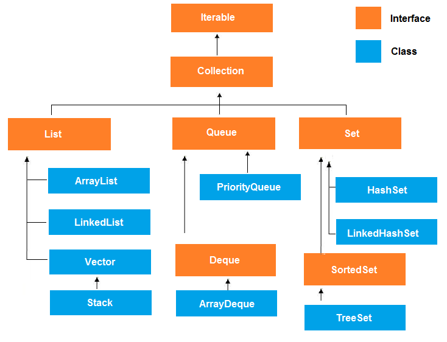
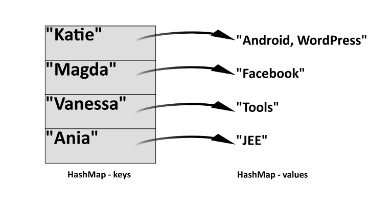

Dynamische Datenstrukturen III: Java Collections
================================================

Lernziele {#lernziele_javacollections}
-----------
* kennen den Aufbau der Java Collections
* erklären am Beispiel des Collection Interfaces die Bedeutung von
    Schnittstellen
* erklären die Bedeutung von generischen Klassen und Schnittstellen
* nutzen wichtige Datenstrukturen der Java Collection-Library
* anwenden Lambda-Funktionen für Suche und Sortieren innerhalb einer
    Collection

Datenstrukturen in Java: Die Collections-Bibliothek
-----------------------------------------------------

Das Package `java.util` stellt häufig genutzte Datenstrukturen wie Listen,
Stacks und Queues mit wichtigen Funktionen bereit. Durch den Einsatz
dieser Klassen können sich Entwickler viel Zeit zum Erstellen und Testen
solcher Datenstrukturen sparen und sich auf die eigentliche
Problemlösung konzentrieren.

Die Schnittstellen Collection und List
------------------------------------------

Die Datenstrukturen aus `java.util` nutzen die gemeinsame Schnittstelle
`Collection`. Diese Schnittstelle definiert allgemeine Methoden und
Funktionen, die innerhalb der Klassen implementiert sind. Eine
Schnittstelle selbst beinhaltet allerdings keinen Code. Schnittstelle
heisst auf Englisch interface. Beide Begriffe werden hier synonym
gebraucht.

{width="80%"}

Bei der Benutzung einer Klasse, die diese Schnittstelle imple­mentiert, wissen Entwickler, welche Funktionen vorhanden sind.
Dies dient der schnelleren und stabileren Software-Entwicklung.

Beispiele für Methoden des `Collection`-Interfaces sind:

* `add(Object o)`
* `remove(Object o)`
* `iterator()`
* `size()`
* `stream()`
* `toArray()`

Das `List`-Interface definiert zusätzliche Methoden, um über
Index-Adressen auf Listenelemente zuzugreifen:

* `remove(int pos)`
* `add(<T> object, int pos)`

Mit dem ebenfalls definierten `ListIterator` können die Datenstrukturen
vorwärts *und* rückwärts durchschritten werden.

##Implementierung der Schnittstellen in Klassen des `java.util` Pakets 

Die bisher behandelten Datenstrukturen sind in Java auch in der
Collections-Bibliothek enthalten:

  ***verwendete Datenstruktur***   | ***In Collections-Bibliothek***
  ---------------------------------+---------------------------------
  primitiver Array                | `ArrayList*` oder `Arrays`
  Verkettete Liste                | `LinkedList*`
  Eigener Stack / Stapel          | `Stack**`
  noch nicht behandelt            | `Map`

`*` beide Klassen implementieren das Interface `List`

`**` Wie in Abbildung 1 sichtbar, ist der `Stack` eine Erweiterung der
`Vector` Klasse. Der `Vector` wiederum ist eine spezielle Form eines
Arrays. Wie bei `ArrayList` ist ein `Vector` dynamisch erweiterbar, hat
aber den Vorteil, dass es **synchronized** ist (d.h. er kann nicht gleichzeitig von mehreren Prozess geändert werden).

Die Verwendung des Interfaces `Collection` ermöglicht die Definition des *inneren* Datentyps schon bei der Instanziierung eines Collections-Objekts:

`List<String> myStrings = new ArrayList<String>();`

`Stack<Card> deck42 = new Stack<Card>();`

Solche Klassen und Schnittstellen werden in Java *generisch* bezeichnet.
In C++ wird der Begriff Template-Klasse genutzt.

Anwendungsgebiete von `ArrayList`, `Vector` und `LinkedList`
------------------------------------------------------------

Die Klassen `ArrayList`, `Vector` und `LinkedList` stellen dynamische Datenstrukturen dar. Die Anzahl der darin gespeicherten Elemente darf sich also zur Laufzeit des Programms ändern. Da alle diese Klassen das `List`-Interface implementieren, stehen (unter anderem) folgende Methoden zur Verfügung:

* `add(int index, Element e)`
* `remove(Element e)`
* `remove(int index)`
* `get(int index)`

Äusserlich betrachtet erfüllen diese Funktionen das Gleiche in allen drei Klassen. Laufzeittechnisch bestehen jedoch Unterschiede:

* `ArrayList` und `Vector` sind intern als Array implementiert. Zugriffe auf die einzelnen Elemente sind also sehr schnell und unabhängig von der Anzahl der enthaltenen Elemente. Jedoch sind Operationen wie das Hinzufügen oder Entfernen von Elementen rechenintensiv, da das gesamte Feld neu strukturiert werden muss. Der Vorteil bei der Benutzung der `Vector`-Klasse liegt insbesondere in der Absicherung für gleichzeitige Zugriffe bei paralleler Programmierung.
* Die Klasse `LinkedList` ist intern als verkettete Liste implementiert und unterstützt das Durchschreiten von vorne nach hinten. Die Zugriffszeit auf einzelne Elemente ist abhängig von der Position und steigt linear mit der Anzahl der Elemente. Das Gleiche trifft auf Einfüge- und Löschoperationen zu.    

Die folgende Abbildung illustriert die Laufzeitabhängigkeiten:

](media/arraylist-vs-linkedlist1.png) 

**Zusammenfassung**: Setzen Sie `ArrayList` oder `Vector` ein, wenn Sie sehr schnelle Lesezugriffe benötigen und relativ wenige Einfüge- und Löschoperationen zu erwarten sind. Andernfalls ist die `LinkedList` ein guter Kandidat.

Weitere Informationen finden Sie hier: [www.programcreek.com/2013/03/arraylist-vs-linkedlist-vs-vector/](http://www.programcreek.com/2013/03/arraylist-vs-linkedlist-vs-vector/)

Die `foreach`-Schleife mit Collections 
-------------------------------------------

Eine grundlegende Operation auf Collections ist die Verwendung von
`foreach` zum Durchlaufen und Bearbeiten aller Elemente in einer Collection. Im Gegensatz zum klassischen `for` müssen Sie hier keine `int`-Schleifenvariable hochzählen und am Ende abbrechen. Das jeweilige Listenelement steht Ihnen direkt zur Verfügung (im Beispiel `String s`). Das führt zu sehr kompaktem Code, wie in diesem Beispiel für einen Stack:

~~~~~~~~~~~~~~~~~~~~~~~~~~~~~
Stack<String> collection = new Stack<String>();
…
for (String s: collection){
	System.out.println("Element = " + s);
}
~~~~~~~~~~~~~~~~~~~~~~~~~~~~~~~~


Welche andere `for`-Schleife könnte man für die gleiche Operation
verwenden? Notieren Sie diese andere `for`-Schleife (diese sollten sie jetzt
ziemlich gut kennen)

Beide Schleifen (`foreach` und das normale `for`) sind eine Kurzform für
ein `while`-Konstrukt. Wen man das Interface `Iterator` verwendet, kann
man eine sehr elegante while-Schleife verwenden. Wir haben das schon bei
der Erweiterung unseres Stacks angetroffen:

Der `Iterator` selbst ist ein Interface. Sobald eine Klasse dieses
Interface implementiert, hat es automatisch das Verhalten eines
Iterators. Siehe dazu die JavaDoc-Hilfe unter `java.util.Iterator`.

Lambda-Funktionen 
------------------
Wie haben vorher einige Sortierfunktionen selbst erstellt. `java.utils` stellt auch hier hocheffiziente fertige Funktionen zur Verfügung, welche die Programmierer nur noch parametrisieren müssen. Dies geschieht mit sogenannten *Lambda-Funktionen*. 
Lambda-Funktionen stammen aus der Welt der funktionalen Programmierung
(LISP). Sie wurden mit Java SE8 zur Sprachspezifikation hinzugefügt und
ermöglichen sehr elegante Sortier- und Suchfunktionen. Wir wollen hier zwei
Beispiele genauer ansehen.

### Sortieren von `ArrayList` und `LinkedList`

In der Praxis werden Listen häufig nach bestimmten Kriterien sortiert.
Mit der Klassenfunktion `sort(..)` stellen Klassen des `List`-Interfaces ein leistungsfähiges
Werkzeug dazu bereit. `sort(..)` bekommt als Parameter eine sogenannte
Lambda-Funktion übergeben.

Gegeben ist folgendes Szenario: Die Klasse `Person` enthält die Attribute `familyName, firstName, city`
und `birthDate` als Strings. In der ArrayList `kundenverwaltung` sind alle
Kunden der Topomedics AG instanziert. Nun kann die Liste mit der `sort()`
Funktion beispielsweise nach `familyName` sortiert werden:

~~~~~~~~~~~~~~~~~~
// loading all data from file into list...
ArrayList<Person> kundenverwaltung = loadAllData();

// in-place sort by familyName
kundenverwaltung.sort((p1,p2)->p1.familyName.compareTo(p2.familyName));
~~~~~~~~~~~~~~~~~~

Die Funktion void `sort(..)` hat einen Lambda-Ausdruck als Parameter, der
das Sortierkriterium beschreibt. `(p1, p2)` sind frei wählbare Variablennamen
für die jeweils zwei zu vergleichenden Listenelemente der internen
Sortierfunktion, ähnlich wie Sie dass vom BubbleSort Verfahren kennen. 
Entsprechend sind `p1` und `p2` im Beispiel vom Datentyp Person. Zur Laufzeit füllt `sort` diese Variablen selbstständig ab.

Die Zeichenfolge `->` stellt die Zuordnung der Variablen zur eigentlichen Vergleichsfunktion dar. 

Danach folgt der eigentliche Vergleich: Wir wollen Nach Familiennamen aufsteigend sortieren. Also greifen auf das Attribut `familyname` von `p1` zu. Dieses ist vom Datentyp String stellt die String-Funktion `compare` bereit. `compare` bekommt das `familyName`-Attribut von `p2` als Parameter. `String.compare` gibt -1 zurück, wenn `p1.familyname` im Alphabet vor `p2.familyName` kommt bzw. 1 im umgekehrten Fall. Der `sort(..)`-Befehl kümmert sich im Hintergrund um allfällige Tauschoperationen.

Da `sort(..)` keinen Rückgabetyp hat, wird `kundenverwaltung` in sich selbst
sortiert. Auf Englisch heisst das "in-place".

**Wiederholungsfragen**

* Wie lautet der Lambda-Ausdruck zum absteigenden Sortieren der Kundenverwaltung nach Nachnamen?

* Wie lautet der Lambda-Ausdruck zum Sortieren einer `int`- oder `double`-Liste?

* Wie sind Lambda-Ausdrücke prinzipiell aufgebaut?

* Wie lautet der Lambda-Ausdruck zum absteigenden Sortieren der Kundenverwaltung nach Alter?


###Listen mit Lambda-Ausdrücken filtern

Häufig werden aus Listen bestimmte Teilmengen benötigt. Nun sollen wir
beispielsweise aus der `kundenverwaltung` nur die Personen finden, die
aus Appenzell stammen. Dazu können wir entweder klassisch alle Elemente
der `kundenverwaltung` Liste einzeln aufrufen und das `city`-Attribut
auf "Appenzell" vergleichen. Eleganter ist folgender Befehl (die Zeilenumbrüche dienen der Lesbarkeit):

~~~~~~~~~~~~~~~~~~~~~~~~~~~~~~~~
List<Person> appenzeller = kundenverwaltung.stream().
	filter(p->p.city.equals("Appenzell")).//filter by city!
	collect(Collectors.toList());
~~~~~~~~~~~~~~~~~~~~~~~~~~~~~~~~

Hier werden die Elemente der Liste `kundenverwaltung` mit der `stream()`
-Funktion zunächst an die Funktion `filter(..)` übergeben.

`filter(p->p.city.equals("Appenzell"))` enthält wieder einen
Lambda-Ausdruck. Zunächst wird die Variable `p` definiert. `p` ist vom Typ
Person und hat ein Klassenattribut namens `city` vom Datentyp String.

Ein String `x` wird mittels `x.equals(String y)`-Funktion auf Gleichheit
geprüft mit dem Parameter-String `y` geprüft. Dieser Ausdruck wird wahr, wenn alle Zeichen in `x` in der
gleichen Reihenfolge in `y` vorkommen.

Der `filter(..)` Aufruf gibt also nur die Instanzen von Person weiter, die
aus "Appenzell" stammen. Die Funktion `collect(Collectors.toList())`
sammelt nun die gefilterten `person`-Objekte und hängt diese fein säuberlich in
eine neue Liste. Diese speichern wir in der neuen Variable
`List<person> appenzeller` ab. 

Entsprechend kann beispielsweise eine Zahlenliste nach Zahlen grösser 10
und kleiner 20 wie folgt gefiltert werden:

Probieren Sie es aus!


```include
skript2c_ueb01_lambda.md
```


Die `Map`-Datenstruktur
------------------------

Die `Map` Datenstruktur verwaltet Verbindungen von Werten (*values*)
mit Schlüsseln (*key*). Primär dient diese Datenstruktur zum schnellen Auffinden von `values` anhand der `keys`, wobei `values` auch komplexe Objekte sein können. Vergleichbar ist die `map` mit Tabellen in Relationalen Datenbanken. Hier entspricht der Primärschlüssel dem `key` einer `map`.

Die `map`-Struktur wird sehr oft eingesetzt. Ein klassisches Beispiel ist
das Telefonbuch (oder die Kontakte auf Ihrem Smartphone). Auch im
BigData Bereich werden derartige Key-Value Datenbanken häufig eingesetzt
(Cassandra von Facebook).

Die `map`-Datenstruktur unterstützt üblicherweise 2 Operationen:

* `put` --&gt; einfügen eines neuen Paares
* `get(key)` --&gt; suchen* nach dem Wert, der zu dem gegebenen
    Schlüssel gehört

{width="80%"}

Dabei muss darauf geachtet werden, dass es nicht zu doppelten Einträgen
(doppelte Schlüssel) kommt. Somit wird folgende Regel implementiert:

* Jeder Schlüssel ist immer nur mit einem Wert verbunden
* Wenn ein Client ein Schlüssel-Wert-Paar einfügt, in der dieser
    Schlüssel (und ein damit verbundener Wert) bereits vorhanden ist,
    dann ersetzt der neue Wert den alten.

In Java wird das Interface `Map` in vielen verschiedenen Klassen
implementiert (siehe dazu Java API). Eine sehr oft verwendete Klasse ist
der `HashMap`.

Code-Beispiel:

~~~~~~~~~~~~~~~~~~~~~~
HashMap<String, String> phoneBook = new HashMap<String,String>();

phoneBook.put("Lisa Jones", "(402) 4536 4674");
phoneBook.put("Prince Harry", "(0044)79854 4512");
~~~~~~~~~~~~~~~~~~~~~~~~~

```include 
skript2c_ueb02_map.md
```

##Wiederholungsfragen {#wdh_javautils}

* Welche Gründe sprechen für den Einsatz vorgefertigter Datenstrukturen aus dem `java.util`-Package?
* Wie wird die Sortierfunktion der `ArrayList`-Klasse parametrisiert?
* Wie lautet der Aufruf zum Filtern einer Double-ArrayList, wenn nur Elemente zwischen 10 und 20 ausgegeben werden sollen?
* Welche Anforderungen gibt es an die `keys` bei der Verwendung der Map-Datenstruktur? 

