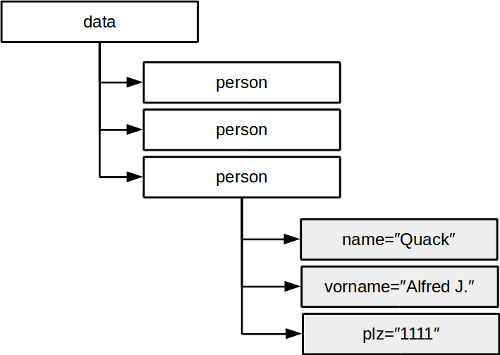

Dynamische Datenstrukturen IV: JSON und XML
==========================================

Lernziele {#lernziele_xmljson}
----------
* beschreiben den Aufbau von baumartigen JSON- und XML-Datenstrukturen
* nutzen Parser, um JSON- und XML-Strukturen zu lesen und in Objekte umzuwandeln
* nutzen JSON- und XML-basierte Webservices 

Die Datenstruktur JSON
-----------------------

Baumartige Datenstrukturen bestehen aus einem Wurzelelement mit beliebig vielen
verschachtelten Unterelementen mit beliebig vielen Unterelementen und
Attributen. Im Vegleich zu den normalisierten Tabellenstrukturen relationaler Datenbanken stellen Bäume gewissermassen die Daten *nicht-normalisierte* Ansicht über alle Tabellen dar. 

{}


JSON (JavaScript Object Notation) ist eine populäre Variante zur
hierarchischen Abbildung von Informationen. Ursprünglich war JSON nur
eine Erweiterung von JavaScript. Seit 2005 bzw. 2006 setzen Yahoo,
Google und viele andere JSON als Datenübertragungsformat für interaktive
Webseiten (AJAX) und Web-Services ein.

~~~~~~~~~~~~~~~~~~~~~~~
{"data":[
	{"person":{
			"name":"Melmak",
			"vorname":"Alf",
			"plz": 1234,
		}
	}
	{"person":{
			"name":"Nachhaus",
			"vorname":"ET",
			"plz": 1248,
		}
	}
	{"person":{
			"name":"Quack",
			"vorname":"Alfred J.",
			"plz": 1111,
		}
	}
  ],
}
~~~~~~~~~~~~~~~~~~~~~~~

Das Beispiel illustriert einen Array (oder Liste) von JSON-Objekten mit
den **"Schlüsseln"** *name*, *vorname* und *plz*. JSON-Objekte bestehen
immer aus ein oder mehreren Schlüssel-Wert Paaren, ähnlich wie Java
Maps. **Werte** können **atomar** sein, hier z.B. Strings. Werte können
weitere JSON-Objekte oder *Listen* enthalten. Listen werden in JSON mit
**\[\]** umschlossen, JSON-Objekte mit **{}**. Schlüssel und Wert sind
mit **":"** getrennt. 

Listenobjekte haben oft ein zusätzliches *ID*-Attribut, ähnlich dem Primärschlüssel einer Tabelle in mySQL.

###JSON mit Java parsen

Es gibt eine Vielzahl von JSON-Parsern für Java. Wir nutzen exemplarisch die auf [www.json.org](http://www.json.org) vorgeschlagene JSON-Java Bibliothek für Java SE 8. Laden Sie das JAR unter folgendem Link und binden Sie diese in Ihr Eclipse-Projekt ein:

<https://search.maven.org/remotecontent?filepath=org/json/json/20151123/json-20151123.jar>

Wichtigen Klassen sind `JSONObject` und `JSONArray`. Sie werden mit der `import` Anweisung einge­bunden:

~~~~~~~~~~~~~~~~~~~~~~~~
import org.json.JSONObject; 
import org.json.JSONArray;
~~~~~~~~~~~~~~~~~~~~~~~~


Zunächst wird die gesamte JSON-Zeichenkette als Parameter dem JSONObject Konstruktor übergeben. Die Variable `jsonString` wurde vorher aus einem beliebigen Datenstrom (`BufferedReader, StreamReader` etc.) eingelesen. 

~~~~~~~~~~
JSONObject obj = new JSONObject(jsonString);
~~~~~~~~~~

Die vorerst wichtigsten Methoden der `JSONObject Klasse` sind:

-   `JSONArray get(String key):` liefert alle Child-Elemente mit Namen *key* als JSONArray, wenn man es als solches *castet*.

-   `double getDouble(String key):` liefert den Attributwert für key als `double`; entsprechende Methoden sind auch für `int` und weitere Datentypen implementiert

-   `JSONObject getJSONObject(String key)`: liefert ein Child-Element für key als `JSONObject`

-   `Set<String> keys()`: liefert die Schlüssel aller enthaltenen Elemente zurück.

Über die in JSONArrays enthaltenen JSONObjects kann man elegant iterieren. Das Gleiche gilt natürlich auch für key-Sets:


~~~~~~~~~~~~~~~~~~~~~~~
obj.keys().forEachRemaining(key -> {
	System.out.println(key);
	System.out.println(obj.get(key).toString());
	System.out.println("***********************************");
	}
);
~~~~~~~~~~~~~~~~~~~~~~~~~

Wenn JSON gleichartig aufgebaut Daten verwendet, können Sie die Listen-Objekte in eine entsprechende Java-Klassen einlesen und beipielsweise als `ArrayList` ablegen. Dies spart für die weitere Verarbeitung viel Zeit, da JSON nicht immer und immer wieder geparst werden muss.  

###JSON – Webservices nutzen

Wie bereits erwähnt, sind JSON-Datenstrukturen sehr häufig als
Datenstruktur von Webservices anzutreffen. Ein Webservice ist ein
http-Server, der auf einer bestimmte URL auf parametrisierte Anfragen
wartet und diese (meist mittels Datenbanken-Zugriff) mit wohl
definierten JSON- oder XML-Datenstrukturen beantwortet. Der Client sendet
Parameter für den Webservice werden entweder via GET in der URL oder als
POST Request. Ein ausführliches Beispiel dazu finden Sie in der nachfolgenden Übung.

```include
skript3_ueb2_json_ws.md
```

Einführung in XML
------------------

XML (eXtensible Markup Language) ist eine sogenannte Baumstruktur bzw.
hierarchische Datenstruktur. XML gibt es schon seit 1998 und war
ursprünglich als Dokumenten-Format konzipiert. Microsoft Word Dokumente
werden beispielsweise als XML-Dokumente gespeichert. XML wird häufig zur
Datenübertragung bei Web-Services verwendet.

### Aufbau

Wie HTML besteht XML aus einem Wurzelelement mit beliebig vielen
verschachtelten Unterelementen mit beliebig vielen Unterelementen und
Attributen. Ein Element wird in der XML-Welt Node genannt. Eine Node
besteht auch hier aus einem Start-TAG und einem End-TAG. Dazwischen
befindet sich der Node-Inhalt.

{}

Im Gegensatz zu HTML sind die Namen der
Nodes nicht von einem Consortium global festgeschrieben, sondern werden
für den jeweiligen Anwendungsfall definiert. Wollen wir beispielsweise
unsere Liste der Klasse Person als XML abspeichern, könnte das Dokument
bzw. als Baumstruktur so aussehen:

~~~~~~~~~~~~~~~~~~~~~~~~~~~~
<?xml version="1.0" encoding="UTF-8"?>
<data>
	<person>
		<name>Quack</name>
		<vorname>Alfred Jodokus</vorname>
		<geburtstag>11.11.2011</geburtstag>
		<strasse>Narrenstrasse 11</strasse>
		<ort>Jeckendorf</ort>
		<plz>1111</plz>
	</person>
	<person>...</person>
	<person>...</person>
</data>
~~~~~~~~~~~~~~~~~~~~~~~~~~~~

Das *data*-Node enthält beliebig viele *person*-Nodes. Diese wiederum
enthalten die entsprechenden Klassenattribute und Werte (als Strings).
Damit wird ein plattform­unabhängiges Austauschformat für Datenobjekte
erreicht. Entsprechend können Daten unter anderem via XML zwischen C++,
Java, PHP und .NET ausgetauscht werden. Und deshalb ist XML
beispielsweise für Webservices so interessant geworden.

###XML Parser

Zur Verarbeitung von XML oder JSON sind entsprechende "Parser"
notwendig. Parser kommt aus dem Englischen und steht für Analysieren.
Bei XML gibt es zwei Varianten:

  ----------------------------------------------------------------------------------------------------------------------------------------------------------------------------------------------------------------------------------------------------------
  ***Simple API for XML (SAX)***                                                                                                                               ***Document Object Model (DOM)***
  ------------------------------------------------------------------------------------------------------------------------------------------------------------ ---------------------------------------------------------------------------------------------
  Sehr schnell, da es Ereignis-gesteuert wird. D.h. die Struktur muss zum voraus bekannt sein, um auf die entsprechenden Elemente /Tags reagieren zu können.   Eher langsam, da das gesamte XML als DOM Baum abgebildet wird.

  Keine Navigation in der XML-Struktur möglich.                                                                                                                Es kann über die Elemente navigiert werden mit `getParent()`, `getChild()`, etc.

  Sehr handlich, wenn es sich um grössere XML-Daten handelt und nur ein bestimmter Ausschnitt (also ein Element) benötigt wird.                                Handlich für kleinere Daten, bzw. wenn das Parsen nicht zu viel Zeit und Speicher benötigt.
                                                                                                                                                               
  Z.Bsp. In einer Nachricht (news) möchte ich nur die Schlagzeile in meiner Applikation verwenden (ohne Texte, Photos, etc.).                                  

  XML wird nicht auf gültige Struktur geprüft.                                                                                                                 XML wird auf gültige Struktur geprüft.
  ----------------------------------------------------------------------------------------------------------------------------------------------------------------------------------------------------------------------------------------------------------

###Aufgabe: Aus XML ein DOM erstellen

Wir wollen den DOM XML-Parser zunächst an einem einfachen Beispiel
umsetzen:

~~~~~~~~~~~~~~~~~~~~~~
<?xmlversion="1.0"encoding="UTF-8"?>
<CATALOG>
	<CD>
		<TITLE>Greatest Hits</TITLE>
		<ARTIST>Elvis</ARTIST>
		<COUNTRY>USA</COUNTRY>
		<YEAR>1977</YEAR>
	</CD>
	<CD>
		<TITLE>Eros</TITLE>
		<ARTIST>ErosRamazzotti</ARTIST>
		<COUNTRY>EU</COUNTRY>
		<YEAR>1997</YEAR>
	</CD>
</CATALOG>
~~~~~~~~~~~~~~~~~~~~~~


Jedes Element im XML entspricht einem Knoten ( = *Node*). Somit besteht
z.Bsp. der Knoten *CD* aus den Sub-Knoten *TITLE*, *ARTIST*, etc. Dies
entspricht einer Liste von Knoten (= `NodeList`).

Um XML-Inhalte mit Java zu lesen, müssen einige Bibliotheken eingebunden
werden:

~~~~~~~~~~~~~~~~~~~~~
import javax.xml.parsers.DocumentBuilder;
import javax.xml.parsers.DocumentBuilderFactory;
import javax.xml.parsers.ParserConfigurationException;
import org.w3c.dom.Node;
import org.w3c.dom.Document;
import org.w3c.dom.Element;
import org.w3c.dom.NodeList;
~~~~~~~~~~~~~~~~~~~~~~~

Die XML-Datei wird in der Klasse `Document` als DOM abgebildet. Dabei
parst der `DocumentBuilder` das XML und wandelt es in ein `Document` (eine Java-interne Datenstruktur) um:

~~~~~~~~~~~~~~~~~~~~~~~~
\* parses XML File filename and returns a NodeList of CD Nodes *\

public NodeList generateNodeList(String filename){
	DocumentBuilderFactory dbf = DocumentBuilderFactory.newInstance();
	DocumentBuilder db;
	Document doc = null;
	try {
		db = dbf.newDocumentBuilder();
		doc = db.parse(new File(filename)); //parse XML
	} 
	catch (SAXException e) {
	e.printStackTrace();
	} 
	catch (IOException e) {
		e.printStackTrace();
	} 
	catch (ParserConfigurationException e) {
		e.printStackTrace();
	}

	//puts all text nodes into full-depth underneath this node:
	//doc.getDocumentElement().normalize(); (old version)
	doc.normalize();
	//get list of CDs:
	NodeList cdElements = doc.getElementsByTagName("CD");
	return cdElements;
}

~~~~~~~~~~~~~~~~~~~~~~~~~~~~~~~

Eine Knotenliste wird an einem bestimmten Tag-Element definiert. 
Somit hat diese `NodeList` alle Knoten mit "CD" und somit auch alle
Kinder (children).

Die Klasse `NodeList` implementiert das Collection-Interfase nicht.
Stattdessen wird mit der NodeList-Methode `item(int i)` per Index auf
die Elemente zugegriffen. Entsprech­end muss man in einer for-Schleife
über diese Liste iterieren, um die weiteren Sub-Knoten auszulesen bzw.
wiederum einer Liste zuweisen.

Die Klasse Node bietet über die Funktion `String getTextContent()` eine
einfache Variante, den Inhalt einer Node x (und aller darin enthaltenen
Nodes) anzuschauen. Dabei werden die Namen der Kinder-Elemente verworfen
und nur deren Text-Inhalte angezeigt:

~~~~~~~~~~~~~~~~~~~~~~~~~~~~~~~~~~
NodeList list = generateNodeList("cd_catalog.xml");
	for (int i=0; i <list.getLength(); i++){
		System.out.println(list.intem(i).getTextContent);
}
~~~~~~~~~~~~~~~~~~~~~~~~~~~~~~~~~~~
Will man stattdessen auf den Inhalt bestimmter Kinder-Elemente
zugreifen, geht man folgendermassen vor:

~~~~~~~~~~~~~~~~~~~~~~~~~~~~~~~~~~~
for (int i=0; i < list.getLength(); i++){
	Node node = list.item(i);
	if (node.getNodeType()==Node.ELEMENT_NODE){
			Element e = (Element)node;
			NodeList titleElements = e.getElementsByTagName("TITLE").
			item(0).getChildNodes();
			NodeList artistElements = e.getElementsByTagName("ARTIST").
			item(0).getChildNodes();

			System.out.println("Title: "+titleElements.item(0).getTextContent());
			System.out.println(", Artist: "+artistElements.item(0).getTextContent());
			System.out.println();
	}
}
~~~~~~~~~~~~~~~~~~~~~~~~~~~~~~~~~~~~~~

Durch das Casting der Nodes von `list` auf das org.w3c.dom-Interface
`Element e` kann man wiederum mit der Methode `getElementsbyName(String
name)` die Child-Nodes parsen. Dies ergibt wiederum eine NodeList, von
der wir in diesem Fall wissen, dass wir nur das erste Element benötigen.

**Fazit:** Man muss als Entwickler den Aufbau der zu lesenden XML sehr
genau kennen. Dann allerdings lassen sich sehr einfach Java-Klassen
einlesen oder speichern.

#### Aufgabe:

Parsen Sie das XML-File `cd_catalog.xml` wie im obigen Beispiel in ein
DOM ab und geben Sie für jede CD den Titel, den Künstler und das Jahr
aus.

###XML – Webservices nutzen

Wie bereits erwähnt, sind XML Datenstrukturen sehr häufig als
Datenstruktur von Webservices anzutreffen. Ein Webservice ist ein
http-Server, der auf einer bestimmte URL auf parametrisierte Anfragen
wartet und diese (meist mittels Datenbanken-Zugriff) mit wohl
definierten XML- oder JSON-Datenstrukturen beantwortet. Der Client sendet
Parameter für den Webservice werden entweder via GET in der URL oder als
POST Request.

Holen wir uns von einem Dictionaire-Webservice die Definitionen für einen
bestimmten Begriff:

<http://services.aonaware.com/DictService/DictService.asmx/Define?word=xml>

Kopieren Sie zunächst diesen Link in Ihren Webbrowser und interpretieren
Sie die Antwort des Servers.

Wie können solche Webservices aus einem Programm benutzt werden? Um den Service aus Java aufzurufen, benötigen Sie eine URL-Verbindung. Unten­stehender Code zeigt Ihnen eine Verbindung sowie eine einfache Ausgabe als String:

~~~~~~~~~~~~~~~~~~~~~~~~~~~~~~
String searchWord = "xml";
//call web-service and get input stream result:
URL url = new URL("http://services.aonaware.com/" +
		"DictService/DictService.asmx/Define?word="+ searchWord);
URLConnection yc = url.openConnection();

//test and show result as String:
BufferedReader in = newBufferedReader(newInputStreamReader(yc.getInputStream()));
String inputLine;
while ((inputLine = in.readLine()) != null) 
	System.out.println(inputLine);
	
in.close();
~~~~~~~~~~~~~~~~~~~~~~~~~~~~~~~~~

Welche Elemente erhalten Sie vom Service?

Wir wollen nur das Element "WordDefinition" dem Benutzer anzeigen. Wie
müssen Sie über die XML-Struktur iterieren, damit Sie den Wert erhalten?


## Generieren und Schreiben von XML und JSON

Die behandelten Java-Bibliotheken stellen ebenfalls Methoden zum
Erstellen von XML / JSON Datenstrukturen zur Verfügung. Diese können in
diesem Kurs nicht mehr behandelt werden, sind jedoch mit etwas Recherche
und Übung leicht nachzuvollziehen.


Wiederholungsfragen {#wdh_xml_json}
---------------------

* XML und JSON sind baumartige Datenstrukturen. Was bedeutet das?
* Was ist der Unterschied zwischen XML und JSON?
* Wie können XML- und JSON basierte Webservices mit Java benutzt werden?
