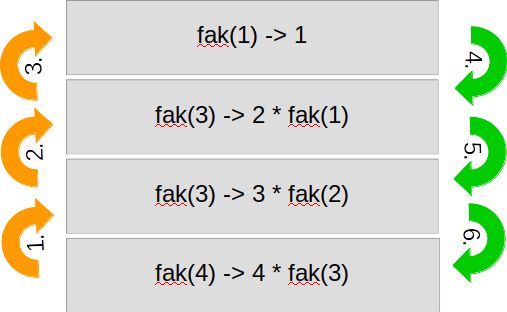

Rekursion und Backtracking
===========================

Lernziele {#lernziele_rekursion}
----------
* verstehen das Prinzip von Rekursion und wenden es Beispielen
 an

* verstehen das Prinzip des Backtracking und zeigen es an einem
    Beispiel auf

Rekursion
---------

Die Rekursion ist ein zentrales Konzept in der Computerwissenschaft, um
komplexere Probleme in einfache-überschaubare Problemgebiete zu
unterteilen. Auch hier gilt das alte Sprichwort: *Teile und Herrsche*. Eine einfache Definition von Rekursion ist:

*Ein Problem wird mit einer Funktion in ein Teil-Problem zerlegt, das
wiederum mit der gleichen Funktion weiter zerlegt wird, bis der Rest des
Problems gelöst ist.*

### Rekursion in einer Datenstruktur

Wir haben die Rekursion bereits bei Datenstrukturen wie verkettete
Listen und Stapel kennengelernt:

~~~~~~~~~~~~~~~~~~~~~~~~~~
public class Node{
	//these are private
	private Object item;
	privateNodenext;
	//constructor
	public Node (Object value){
		next = null;
		item = value;
	}
...
}
~~~~~~~~~~~~~~~~~~~~~~~~~~~

Die Klasse `Node` besitzt als Eigenschaft wiederum sich
selbst. Sie verwendet rekursiv die eigene Klasse, um auf das
nächste Element zu verweisen.

###Rekursive Algorithmen

Unter rekursiven Algorithmen versteht man Funktionen, in denen Aufrufe zu sich selbst vorkommen. Entsprechend muss eine *Abbruchbedingung* definiert sein, damit
es nicht zu unendlichen Aufrufen der Methode kommt. 

**Beispiel: Fakultätsberechnung **

Es gibt unzählige Beispiele für Probleme, die man am einfachsten mittels
einer Rekursion löst. Ein einfaches mathematisches Problem ist die
Berechnung der Fakultät (`fak(n)` = Produkt der Zahlen von 1 bis `n`) , hier in Pseudo-Code:

~~~~~~~~~~~~~~~~~~~~~~~~~~~~~~~~~~~~~
int fak(n){
	if (n==1)
		return 1;
	return n * fak(n-1);
}
~~~~~~~~~~~~~~~~~~~~~~~~~~~~~~~~~~~~~

Die Funktion gibt das Produkt von `n` multipliziert mit dem Rückgabewert von `fak(n-1)` aus. Tatsächlich wird für jedem rekursiven Aufruf ein neuer Abschnitt im Arbeitspeicher (auf dem *Stack*) angelegt. Beim Erreichen der Abbruchbedingung (hier `n==1`) werden die Speicherbereiche vom Stack wieder von oben nach unten freigegeben.



**Beispiel: Fibonacci-Reihe berechnen **

Die Fibonacci-Reihe (1,1,2,3,5,8,…)
kann mittels Rekursion berechnet werden:

](media/Fibonacci_sequence_-_optional_starting_with_zero.jpg){}

~~~~~~~~~~~~~~~~
public int calculate(int number) {
	if((number == 0) || (number == 1)){
		return number;
	}
	else {
		return calculate(number -1) + calculate(number-2);
	}
}
~~~~~~~~~~~~~~~~~~~

Die Methode `calculate` ist ein Beispiel einer
*Mehrfach-Rekursion*, da die Methode gleich mehrmals (hier zweimal)
aufgerufen wird.

**Beispiel: Rekursives durchlaufen von Baumstrukturen**

Rekursion eignen sich auch zum Durchsuchen von Baum-Strukturen, um die
einzelnen Knoten durchzugehen. Wir können mit der Function `visitRecursively` JSON- oder XML-Srukturen durchlaufen und dabei alle Child-Elemente (Kinder) in der Struktur rekursiv aufrufen:

~~~~~~~~~~~~~~~~~~~~~~~
public void visitRecursively(Node node) {
	// get child nodes:
	NodeList list = node.getChildNodes();
	for (int i=0; i&lt;list.getLength(); i++) {
		// get child node:
		Node childNode = list.item(i);
		System.out.println("Found Node: " + childNode.getNodeName()
			+ " - with value: " + childNode.getNodeValue());
		// call next children with recursion:
		visitRecursively(childNode);
	}
}
~~~~~~~~~~~~~~~~~~~~~~~~

Analog dazu kann man natürlich auch Dateisysteme mit rekursiven Funktionen durchlaufen.

Rekursion vs Iteration
--------------------------

Jede Rekursion kann in eine Iteration umgewandelt werden. Die Rekursion
ist meistens die elegantere Lösung. Jedoch sind rekursive Funktionen aufgrund des oben beschriebenen Stack-Speicherhandlings oft weniger performant. Ja nach geforderter Performance macht es also mehr Sinn,
ein Problem iterativ (also mit einer Schleife) oder rekursiv zu lösen.
Gewisse Programmiersprachen verbieten explizit die Iteration und
bevorzugen die Rekursion (z.Bsp. LISP oder Prolog).

Beispiel: Eine Funktion soll die Zahlen von n1 bis n2 ausgeben, wobei n1 <= n2 sein soll.

Als Iteration würden wir es so programmieren:

~~~~~~~~~~~~~~~~~~~~
public static void printSeries(int n1, int n2){
	for (int i = n1; i < n2; i++){
		System.out.print(i + ",");
	}
	System.out.print(n2);
}
~~~~~~~~~~~~~~~~~~~~~

Wir können diese Iteration auch als Rekursion programmieren:

~~~~~~~~~~~~~~~~~~~~~~~
public static void printSeries(int n1, int n2){
	//stop recursion:
	if (n1 == n2){
		System.out.print(n2);
	} 
	else {
		System.out.print(n1 + ",");
		printSeries(n1 + 1, n2); //recursive call
	}
}
~~~~~~~~~~~~~~~~~~~~~~~

```include
skript4_ueb01_rekursion.md
skript4_ueb02_Mandelbrot.md
```

Backtracking
-------------

Backtracking ist eine Form von Rekursion, bei der verschiedene
Lösungswege für ein Problem durchsucht werden. Wenn man beim Suchen der
Lösung merkt, dass dies der falsche Weg ist, wird der Weg bis zur
letzten Entscheidung zurückgegangen und es wird nach einer neuen Lösung
gesucht. Am einfachsten stellt man sich das Suchen nach einer Lösung in
Form eines Baumes vor:


{}   

1. Man beginnt bei *Root* und hat A oder B zur Auswahl. Man wählt A.                                                                          
2. Bei A haben wir C oder D zur Auswahl. Man wählt C.                                                                          
3.  C ist schlecht. Gehen wir zurück zu A.

4.  Bei A haben wir C schon probiert. Versuchen wir D.                                                                          
5.  D ist schlecht. Gehen wir zurück zu A.
                                                                         
6.  Bei A haben wir keine weitere Lösungswege. Gehen wir zurück zu *Root*.                                                                          
7.  Bei *Root* haben wir A schon probiert. Versuchen wir B.                                                                          
8.  Bei B haben E und F zur Auswahl. Versuchen wir E.                                                                          
9.  E ist gut. Wir haben einen Weg gefunden.

Der Baum ist eine abstrakte Struktur, um Lösungswege zu
veranschaulichen. Bei den meisten Problemen haben wir keine
Baumstruktur, sondern müssen mit anderen Datenstrukturen (z.Bsp. Arrays)
arbeiten. In Pseudo-code sieht ein Backtracking-Algorithmus wie folgt
aus:

~~~~~~~~~~~~~~~~~~~~~~~~~~
boolean solve(Node n) {
	if n is a leafnode {
		if the leaf is a goal node return true
	else 
		return false
	}
	else {
		foreach child c of n {
			if solve(c) succeeds, return true
		}
		return false
	}
}
~~~~~~~~~~~~~~~~~~~~~~~~~~~

Wichtig ist, dass die Backtracking-Funktion als *boolean* umgesetzt
wird. Somit wissen wir, wenn ein bestimmter Knoten (*Node*) *true* ist,
dass wir einen gültigen Lösungsweg haben.

Der Algorithmus besteht aus 2 Teilen:

Am Ende eines Lösungsweges prüfen wir den Erfolg:

~~~~~~~~~~~~~~~~~~~~~~~~~~~
if the leaf is a goal node:
	return true
else: 
	return false
~~~~~~~~~~~~~~~~~~~~~~~~~~~

Und der rekursive Teil, wo wir solange in Unter-Wegen suchen (mit
Rekursion) bis eine erfolgreiche Lösung gefunden wurde oder gar keine:

~~~~~~~~~~~~~~~~~~~~~~~~~~~
foreach child c of n {
	if solve(c) succeeds, return true
}
return false
~~~~~~~~~~~~~~~~~~~~~~~~~~~

Quelle:
[*http://www.cis.upenn.edu/\~matuszek/cit594-2012/Pages/backtracking.html*](http://www.cis.upenn.edu/~matuszek/cit594-2012/Pages/backtracking.html)
(Stand Sept. 2015)
