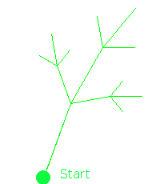

## Übung: Fraktales Farn erstellen

**Lernziele**

* arbeiten sich in fremden Java-Code ein 
* nutzen und verändern komplexe rekursive Funktionen

**Zeit:** 60 Minuten

###Fraktale
Geometrische Fraktale sind - vereinfacht gesagt - Grafiken, die durch wiederholte Anwendung des gleichen Bildungsvorschrift (bzw. -algorithmus) entstehen. Bekannte Vertreter geometrischer Fraktale sind:

* Koch-Kurve
* Farn
* Schneeflocke
* Mandelbrot (basieren auf komplexen Zahlen)

Wenn Sie sich aufmerksam in der Natur umschauen, werden Sie viele Beispiele fraktaler Muster erkennen. Betrachten Sie eine Schneeflocke unter der Lupe, oder Romanesco (vor dem Kochen), oder ganz gewöhnliche Bäume. In diese Übung lernen Sie einen Farn zu zeichnen, wie im Bild dargestellt.

Zunächst benötigen wir eine sogenannte `Turtle`-Klasse, welche einfach *nur* aufeinanderfolgende Striche mit bestimmten Winkel und Länge auf der Oberfläche zeichnet:

~~~~~~~~~~~~~~~~~~~~~~
/**
 * 
 * @author http://alfred-nussbaumer.at/ikt/informatik/wpf/JAVA/javahtml/node192.html
 * Die Instanzvariablen a und b legen die Startposition bzw. die aktuelle Position der Turtle. 
 * Die Klasse Container stellt ein Objekt zur Verfügung, das andere Objekte enthalten kann; hier ist das die Zeichenfläche g. 
 * In der Methode fd(strecke) wird zunächst der aktuelle Winkel der Turtle ins Bogenmaß umgerechnet. 
 * Aus der Strecke und dem Winkel wird mit Hilfe der Winkelfunktionen der Zuwachs für dx und dy berechnet 
 * und dann die Linie von (x,y) nach (x+dx,y+dy) gezeichnet. Die neue Position wird anschließend wieder in x und y gespeichert. 
 * In der Methode rt(winkel) wird der negative Drehwinkel einfach zum aktuellen Winkel addiert 
 * (das Vorzeichen des Drehwinkels ergibt sich aus der Orientierung der y-Achse von oben nach unten).
 */
class Turtle {
  double x;
  double y;
  double alpha;
  Container c;
  Graphics g;

  /**
   * ctor
   * @param ct graphics container instance (das 2D Obejkt, in dem "gemalt"wird)
   * @param x	Startpunkt Abstand von links
   * @param y Startpunkt Abstand von oben
   */
  Turtle(Container ct, double x, double y) {
      c = ct;
      g = c.getGraphics();
      g.setColor(Color.green);
      this.x = x;
      this.y = y;
      alpha = -70;	//Startwinkel
  }

  public void forward (double strecke) {
      double aa = alpha * Math.PI / 180;
      double dx = strecke * Math.cos(aa);
      double dy = strecke * Math.sin(aa);
      g.drawLine((int)x, (int) y, (int) (x+dx), (int) (y+dy));
      x+=dx;
      y+=dy;
  }

  public void rightTurn(double winkel) {
      alpha = alpha - winkel;
  }
}
~~~~~~~~~~~~~~~~~~~~~~

Das eigentliche Berechnen des Fraktals ist nicht wirklich schwer. Betrachten Sie die folgende Abbildung gemeinsam mit dem Quellcode der Funktion `farnwedel`.

Wir führen dies der Einfachheit halber in einem *Applet* aus:

~~~~~~~~~~~~~~~~~~~~~~~~~~~~~
/**
 * 
 * @author http://alfred-nussbaumer.at/ikt/informatik/wpf/JAVA/javahtml/node197.html
 *
 */
public class Farn extends Applet {

    public void paint (Graphics g) {
    	this.setBackground(Color.white);
        Turtle t = new Turtle(this,100,450);
        farnwedel(t,100);
    }

    /**
     * rekursive Funktion zum Erstellen des Farn-Fraktals
     * @param t Turtle (Zeichner)
     * @param strecke 
     */
    public void farnwedel(Turtle t, double strecke) {
        if (strecke>1) {
            t.forward(strecke);
            t.rightTurn(-60);
            farnwedel(t,strecke/2);
            t.rightTurn(50);
            farnwedel(t,4*strecke/5);
            t.rightTurn(50);
            farnwedel(t,strecke/2);
            t.rightTurn(-40);
            t.forward(-strecke);
        }
    }
}
~~~~~~~~~~~~~~~~~~~~~~~~~~~~~

Analysieren Sie die Wirkungsweise der Funktion `farnwedel` und beantworten Sie die folgenden Fragen:

1. Was ist die Abbruchbedingung für die rekursive Aufrufe?

	\_\_\_\_\_\_\_\_\_\_\_\_\_\_\_\_\_\_\_\_\_\_\_\_\_\_\_\_\_\_\_\_\_\_\_\_
	
	\_\_\_\_\_\_\_\_\_\_\_\_\_\_\_\_\_\_\_\_\_\_\_\_\_\_\_\_\_\_\_\_\_\_\_\_

	\_\_\_\_\_\_\_\_\_\_\_\_\_\_\_\_\_\_\_\_\_\_\_\_\_\_\_\_\_\_\_\_\_\_\_\_

2. Wie oft ruft sich `farnwedel` in jedem Durchlauf selbst auf?

	\_\_\_\_\_\_\_\_\_\_\_\_\_\_\_\_\_\_\_\_\_\_\_\_\_\_\_\_\_\_\_\_\_\_\_\_
	
	\_\_\_\_\_\_\_\_\_\_\_\_\_\_\_\_\_\_\_\_\_\_\_\_\_\_\_\_\_\_\_\_\_\_\_\_

	\_\_\_\_\_\_\_\_\_\_\_\_\_\_\_\_\_\_\_\_\_\_\_\_\_\_\_\_\_\_\_\_\_\_\_\_

3. Erstellen Sie aus obigen Code Ihr eigenes Farn-Programm.

3. Ändern Sie die Parameter des äusseren `farnwedel`-Aufrufs, so dass das Fraktal grösser dargestellt wird.

4. Kommentieren Sie die letzten beiden Zeilen im der Funktion `farnwedel`-Aufrufe aus. Starten Sie das Applet und erklären Sie die signifikant andere Darstellung.   

**Lösungsvorschlag:**

`Skript4_Farn.java`

