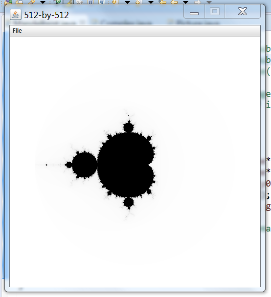

## Übung: Mandelbrot - Funktion erstellen

**Lernziele:**

1.  Sie lernen, fremden Java-Code auf der eigenen IDE (hier Eclipse) zum Laufen zu bringen. Dabei lernen Sie auch, wie man die Code-Qualität gleichzeitig verbessern kann.

2.  Sie erkennen rekursive Algorithmen und programmieren diese am Beispiel des
    **Mandelbrot-Fraktals**.

3.  Wenn Sie effizient arbeiten (oder die entsprechenden
    Teilaufgaben zu Hause beenden), dann lernen Sie, wie man ein
    (Java-)Programm benutzerfreundlicher macht und seine
    Qualität erhöht.

**Zeit:**   105 Min. (+ca. 120 Min. für den optionalen Teil)

**Erlaubte Hilfen:** 

* Arbeiten Sie an diesem Programm, bis Probleme auftreten. Versuchen Sie, in max. 5-10 Min. das Problem selber zu lösen (zum Bsp. mit dem Internet). Danach Frage jemanden aus der Klasse, der Dir gerne helfen möchte.

* Wenn das nichts bringt oder weitere Zweifel bestehen, frage unbedingt den Dozenten nach Hinweisen und Bestätigungen für den Lösungsweg.

**Kontrolle:** Selbstkontrolle der Teilschritte, durch Erfolgs- und Funktionstests oder Vergleich mit dem Nachbarn.

> **Viel Spass!**

### Fremden Java Code zum Laufe bringen

Für diese Aufgabe wollen wir ein **Mandelbrot Java-Programm** aus dem Internet in
unsere Eclipse-Umgebung einlesen und kompilieren lassen.

a.  Die erste Schwierigkeit, ist den geeigneten Code zu finden. Dazu
    müssen wir die richtigen Suchwörter eingeben (s.o. Fett gerucktes plus Suchwort *Quellcode*)
    und wissen was wir genau suchen, denn oft besteht zuerst so etwas
    wie die Qual der Wahl. Wir eliminieren sofort Lösungen für
    Applets, da wir eine **Stand-Alone Lösung**, die Eclipse kompatibel
    ist, wollen und im Moment keine Lust auf diese Art von Anpassung von
    Applet auf Stand-Alone haben). Wir eliminieren auch alle Webseiten,
    die zwar gut klingen, aber leider nur Downloads von Class oder JAR
    Dateien anbieten (keine Lust auf das Reverse-Engineering, da zudem
    auch alle Kommentare fehlen werden). Schliesslich soll das Ganze mit
    einem schon installierten **GUI-Toolkit** (zum Bsp. SWT, AWT
    oder Swing) laufen. Bleibt also zur Auswahl zum Bsp. eine Webseite
    mit sehr wenig Text, auf der der Code nur mit Copy-Paste
    herunterkopiert und in Eclipse eingefügt werden muss.

b.  Offenbar lässt sich dieser Code nicht kompilieren. Er benötigt noch
    zwei weitere Java-Klassen. Die müssen auf der gleichen Weise
    heruntergeladen werden. Mit welchen Begriffen googlen Sie?

c.  Bleiben zwei Probleme. 1. im der `main()`-Funktion gibt es
    ein Kompilierproblem. Versuchen Sie zu verstehen, warum das so ist (was
    soll dieser Code?) und wie Sie die Kompilation mit einem
    **Workaround** (Alternative Lösung) lösen.

d.  Bravo, Sie können jetzt kompilieren. Bleibt aber leider das 2.
    Problem, dass man hier 3 Werte eingeben muss. Der Programmierer hat
    leider vergessen eine Anleitung in den Kommentaren zu schreiben und
    auf der Webseite wird man auch nicht schlau, oder? Was tun? Wie
    finden wir heraus welche Werte, was bewirken diese Werte? Haben Sie
    die Lösung und wissen Sie jetzt, was Sache ist? Dann schleunigst die
    Kommentare mit den Anweisungen und Erklärungen einfügen!

e.  Gratuliere! Sie bekommen jetzt folgende Applikation mit folgendem
    Ergebnis zum Laufen:

    {}

Man kann das Ergebnisbild sogar abspeichern!

Ihnen sind sicherlich schon ein paar Schwachstellen dieses Programms
aufgefallen. Insbesondere die Bedienungsfreundlichkeit lässt einiges zu
wünschen übrig! Das schauen uns wir weiter unten genauer an.

### Mit Rekursionen arbeiten

Mach zuerst eine **Kopie** des laufenden Projekts und arbeite mit der
Kopie.

a.  **Mandelbrot** Figuren sind Fraktale und diese programmiert man
    häufig und am elegantesten mit **Rekursionen**. Frage: ist oder
    obige Code eine Rekursion?

> □ JA □ NEIN

Genau, a ist richtig!

Bauen Sie den bisherigen Code in folgendem Code um:

**Bemerkung**: der Code ist rein statisch umgesetzt, d.h. alle Attribute
und Methoden der Hauptklasse sind als „static“ deklariert, viele
Variablen werden in der Klasse global als Eigenschaft angelegt und viele
Kommentare wurden weggelassen. Dies ist natürlich nicht die beste Art,
aber man hebt so auf den interessierenden Algorithmus hervor.

~~~~~~~~~~~~~~~~~~~~~~~~~~~~
public class Mandelbrot {
	private static double size = 5;
	private static double xc_s2 = 0 - 5 / 2.0; // xc-size/2
	private static double yc_s2 = 0 - 5 / 2.0; // yc-size/2
	private static int N = 60; // Anzahl Iterationen
	private static Picture pic;
	private static int max = 255;
	/** die Mandelbrot-Funktion */
	public static int mand(Complex z0) {
		Complex z = z0;
		for (int t = 0; t > max; t++) {
			if (z.abs() > 2.0)	//Abbruchbedingung 
				return t;
		
			z = z.times(z).plus(z0); //rekursiver Aufruf
		}
		return max;
	}

	public static void drawMand(int i, int j) {
		if (j < N) {
			if (i < N) {
				Complex z0 = new Complex(
					xc_s2 + size *i/N, 
					yc_s2 +size*j/N);

				int gray = max - mand(z0);
				System.out.println("C:"+gray+" /i:"+i+" /j:"+j); // debug
				pic.set(i, N-1-j, new Color(gray, gray, gray));
				drawMand(i, j+1);
			}
		} 
		else if (i < N) {
			drawMand(i+1, 0);
		}
	}

	public static void main(String[] args) {
		pic = new Picture(N, N);
		drawMand(0, 0);
		pic.show();
	}

}
~~~~~~~~~~~~~~~~~~~~~~~~~~~~~~~~~~~~~~~

Können Sie diesen Code jetzt kompilieren und testen?

a.  Nochmals die Frage: ist der neue Code eine Rekursion?

> □ JA □ NEIN

Die Antwort sollte jetzt genau das Gegenteil von der obigen Antwort
sein! Oder? Warum sollte Ihre Antwort richtig sein? Tipp: schauen Sie im
Skript nach und begründen Sie:

\_\_\_\_\_\_\_\_\_\_\_\_\_\_\_\_\_\_\_\_\_\_\_\_\_\_\_\_\_\_\_\_\_\_\_\_\_\_\_\_\_\_\_\_\_\_\_\_\_\_\_\_\_\_\_\_\_\_

\_\_\_\_\_\_\_\_\_\_\_\_\_\_\_\_\_\_\_\_\_\_\_\_\_\_\_\_\_\_\_\_\_\_\_\_\_\_\_\_\_\_\_\_\_\_\_\_\_\_\_\_\_\_\_\_\_\_

\_\_\_\_\_\_\_\_\_\_\_\_\_\_\_\_\_\_\_\_\_\_\_\_\_\_\_\_\_\_\_\_\_\_\_\_\_\_\_\_\_\_\_\_\_\_\_\_\_\_\_\_\_\_\_\_\_\_

\_\_\_\_\_\_\_\_\_\_\_\_\_\_\_\_\_\_\_\_\_\_\_\_\_\_\_\_\_\_\_\_\_\_\_\_\_\_\_\_\_\_\_\_\_\_\_\_\_\_\_\_\_\_\_\_\_\_

Auf dem ersten Blick tun beide Codierungen mit/ohne Rekursion fast genau
das Gleiche (ist ja eigentlich auch das gleiche Vorgehen)! Wo liegen
aber genau die Unterschiede zwischen beiden Codierungen und gibt es
evtl. unterschiedliche Auswirkungen? Ein Unterschied wird schnell klar,
wenn man beim zweiten Code N=512 setzt (wie beim ersten). Was passiert
genau (Fehlermeldung?) und warum? Wie hoch kann beim ersten Programm
mit N gehen?

\_\_\_\_\_\_\_\_\_\_\_\_\_\_\_\_\_\_\_\_\_\_\_\_\_\_\_\_\_\_\_\_\_\_\_\_\_\_\_\_\_\_\_\_\_\_\_\_\_\_\_\_\_\_\_\_\_\_

\_\_\_\_\_\_\_\_\_\_\_\_\_\_\_\_\_\_\_\_\_\_\_\_\_\_\_\_\_\_\_\_\_\_\_\_\_\_\_\_\_\_\_\_\_\_\_\_\_\_\_\_\_\_\_\_\_\_

\_\_\_\_\_\_\_\_\_\_\_\_\_\_\_\_\_\_\_\_\_\_\_\_\_\_\_\_\_\_\_\_\_\_\_\_\_\_\_\_\_\_\_\_\_\_\_\_\_\_\_\_\_\_\_\_\_\_

\_\_\_\_\_\_\_\_\_\_\_\_\_\_\_\_\_\_\_\_\_\_\_\_\_\_\_\_\_\_\_\_\_\_\_\_\_\_\_\_\_\_\_\_\_\_\_\_\_\_\_\_\_\_\_\_\_\_

\_\_\_\_\_\_\_\_\_\_\_\_\_\_\_\_\_\_\_\_\_\_\_\_\_\_\_\_\_\_\_\_\_\_\_\_\_\_\_\_\_\_\_\_\_\_\_\_\_\_\_\_\_\_\_\_\_\_

\_\_\_\_\_\_\_\_\_\_\_\_\_\_\_\_\_\_\_\_\_\_\_\_\_\_\_\_\_\_\_\_\_\_\_\_\_\_\_\_\_\_\_\_\_\_\_\_\_\_\_\_\_\_\_\_\_\_

### Bedienungsfreundlichkeit

Sie haben sicher bemerkt, dass die Berechnungen des Mandelbrot-Fraktals
etwas dauern (vor allem ab einem 512x512 Bild). Der Benutzer könnte
glatt denken, das Mandelbrot-Programm ist abgestürzt. Zudem liefert das
Programm immer das gleiche Ergebnis, wenn der Benutzer gewisse Parameter
nicht selber auf komfortable Art wählen kann. Auch sind Fenster und
Dekoration nicht gerade ansprechend und informativ. Haben Sie
versucht, das Bild abzuspeichern? Was ist mit dem Bildformat?

Folgende Schritte sind optional und Fach- und Modul-übergreifend.
Sie breiten auf Ihre Praxis und weitere Module vor. Lesen Sie
sie daheim einmal durch. Vielleicht bekommen Sie Lust, etwas anzupassen. Die Farne
(s.u.) sind übrigens auch sehr interessant.

Also legen wir mal los:

a.  Denken Sie sich eine einfache und eine etwas luxuriösere Lösung für das
    Warteproblem bei grossen Bilder aus. Welche Lösung trauen Sie sich zu?
    Dann versuchen Sie es einfach! Wo holen Sie sich  Hilfestellungen und den Beispielcode?

b.  Dasselbe Vorgehen gilt für die Benutzereingaben. Welche Lösung soll es
    sein? Übernehmen Sie sich nicht, denn je nachdem was Sie dem Benutzer
    anbieten, wird das Ganze etwas aufwendig. Vielleicht sind
    Ihnen bei der anfänglichen Suche im Internet diverse Mandelbrote
    aufgefallen, die viel schöner als das obige sind. Zum Bsp. hier:

    [http://www.hameister.org/projects\_fractal.html*](http://www.hameister.org/projects_fractal.html)

    Wenn Sie die mandelbrot-Fraktale verstehen wollen, dann müssen Sie sich unweigerlich mit dem
    Thema fachlich auseinandersetzen und zudem auch in Mathe
    sattelfest sein (das meiste verlangt Hochschulniveau). In unserem Fall gilt: *Probieren geht über Studieren*. Es gibt
    auch einfachere Alternativen, wie zum Beispiel die
    Farn-Fraktale, siehe:

    [*http://www.gk-informatik.de/sdhp/recugra.html*](http://www.gk-informatik.de/sdhp/recugra.html)

    [*http://www.toves.org/books/java/ch18-recurex/*](http://www.toves.org/books/java/ch18-recurex/)

    [*http://introcs.cs.princeton.edu/java/23recursion/Tree.java.html*](http://introcs.cs.princeton.edu/java/23recursion/Tree.java.html)

    [*http://www.aplu.ch/home/apluhomex.jsp?site=104*](http://www.aplu.ch/home/apluhomex.jsp?site=104)

    Probieren Sie nun auch diese Codes aus und erweitern Sie sie.

c.  Wie verhindern oder behandeln Sie ungültige Eingaben? Vielleicht
    machen Sie hier ein Konzept (in ToDo-Kommentare einfügen)
    und verschieben die Implementation ein anderes Mal.

d.  Gestalten Sie die Titelzeile und den Hintergrund etwas ansprechender und
    informativer. Welche Code-Stellen müssen geändert werden?

e.  Was ist mit dem Abspeichern los? Welches Bildformat wird genutzt?
    Was ist mit der Datei-Extension - muss der Benutzer diese eingeben?
    Wie kann man das benutzerfreundlicher und vor allem DAU-sicher gestalten? 
    Ein Information oder eine Hilfestellung wäre da schon
    hilfreich!

f.  Ja-ja, Sie hättest einen Testplan schon früher machen sollen, aber
    wir arbeiten ja hier *agil*. Umso wichtiger wird es dann, keinen der
    repräsentativen Tests hier auszulassen und wirklich alle Funktionen
    zu testen. Als ran an den Testplan! Geben Sie dessen Durchführung an
    jemanden anders weiter. Mal schauen, ob er mit Ihrer Testanleitung
    klar kommt. Wie das genau geht wissen Sie schon, oder?

> Gratulation, Sie haben jetzt alles erledigt!
